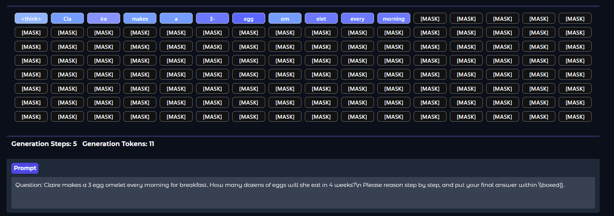
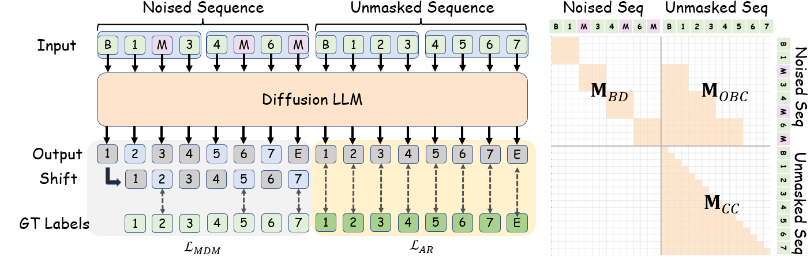

# [NBDiff] A Principled Adaptation Path for Diffusion LLMs

<p align="left">
<a href="https://arxiv.org/abs/2512.06776" alt="arXiv">
    </a>
<a href="https://arxiv.org/pdf/2512.06776" alt="arXiv">
    </a>
<a href="https://huggingface.co/yuchuantian/NBDiff-7B-Instruct/" alt="NBDiff-7B-Instruct">
    </a>
</p>  

**_Pushing Diffusion LLM Performance to Its Limits!_**

- 🔭 We try to find an adaptation path from AR to Block-Diffusion;

- ⚡ Block-Diffusion with larger block-sizes has good acceleration potentials;
- 🤔 Long-context and reasoning lead to significant performance gains.






## Model Weight

We have opensourced the weights of NBDiff-7B-Instruct/Base. Please feel free to download them:

<p align="left">
<a href="https://huggingface.co/yuchuantian/NBDiff-7B-Instruct/" alt="NBDiff-7B-Instruct">
    </a>
<a href="https://huggingface.co/yuchuantian/NBDiff-7B-Base/" alt="NBDiff-7B-Base">
    </a>
</p>  


## Demo

We have provided a demo to run our Diffusion model. We recommend using python==3.10. Before running this demo, please install the following supporting packages:

```shell
torch==2.6
transformers==4.53.2
```


To start the demo, please run:

```shell
python demo.py
```


## Citation

If you find this research useful, please cite:

```
@misc{tian2025nexttokennextblockprincipledadaptation,
      title={From Next-Token to Next-Block: A Principled Adaptation Path for Diffusion LLMs}, 
      author={Yuchuan Tian and Yuchen Liang and Jiacheng Sun and Shuo Zhang and Guangwen Yang and Yingte Shu and Sibo Fang and Tianyu Guo and Kai Han and Chao Xu and Hanting Chen and Xinghao Chen and Yunhe Wang},
      year={2025},
      eprint={2512.06776},
      archivePrefix={arXiv},
      primaryClass={cs.CL},
      url={https://arxiv.org/abs/2512.06776}, 
}
```

## Acknowledgement

We sincerely thank the openPangu team for their code.
